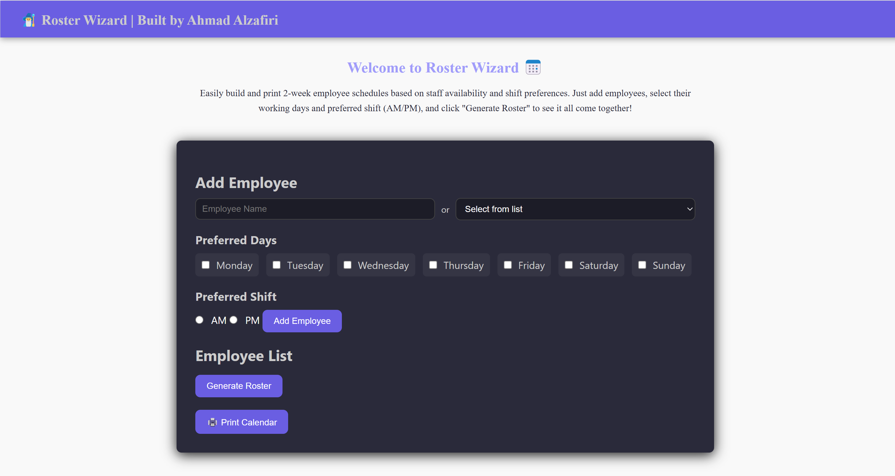
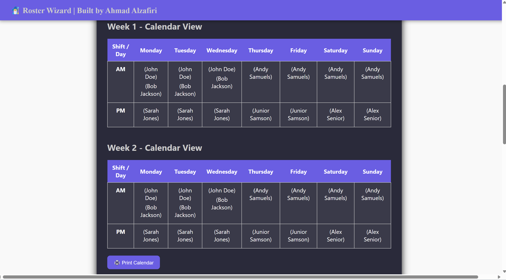
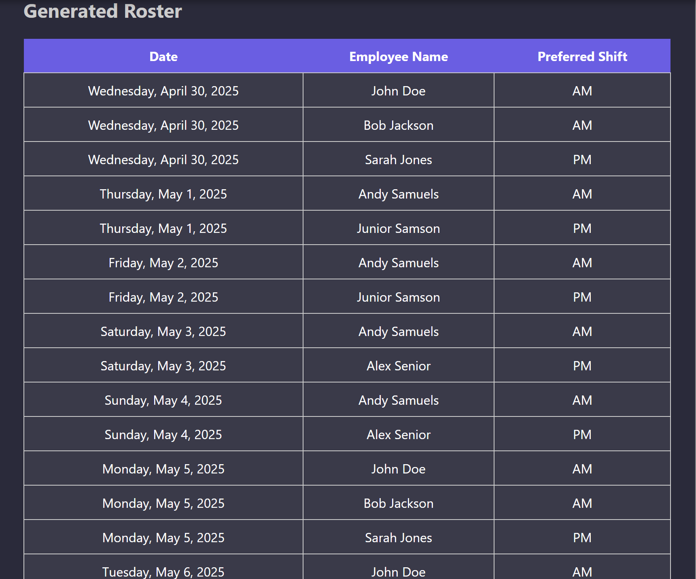

# 🧙‍♂️ Roster Wizard — Frontend (Angular)

Roster Wizard is a clean and intuitive scheduling tool that helps you build a printable 2-week employee roster based on individual preferences. This is the Angular-based frontend UI of the application.

## 💡 Features

- Add employees with preferred days and shift (AM/PM)
- Select from a predefined list or enter custom names
- Generate a printable 2-week roster or save PDF
- View the schedule in both list and calendar layout
- Dark theme styling with professional UI
- Export roster to PDF using the print button

## 🚀 Getting Started

### Prerequisites

- Node.js (v18+)
- Angular CLI (`npm install -g @angular/cli`)

### Setup & Run

```bash
git clone https://github.com/mcdgithubber/roster-wizard-frontend.git
cd roster-wizard-frontend
npm install
ng serve
```

Visit the app at:  
🌐 http://localhost:4200

### ⚙️ API Integration

To generate a roster make sure the backend is running at:  
https://localhost:7043

If needed, update the API base URL in:  
src/app/services/roster.service.ts

```ts
private apiUrl = 'https://localhost:7043/api/Roster';
```

---

## 🖼 Screenshots

| Employee Form | Calendar View | Roster Table |
|:--:|:--:|:--:|
|  |  |  |

---

## 🧑‍💻 Author

**Ahmad Alzafiri**  
GitHub: [@mcdgithubber](https://github.com/mcdgithubber)
